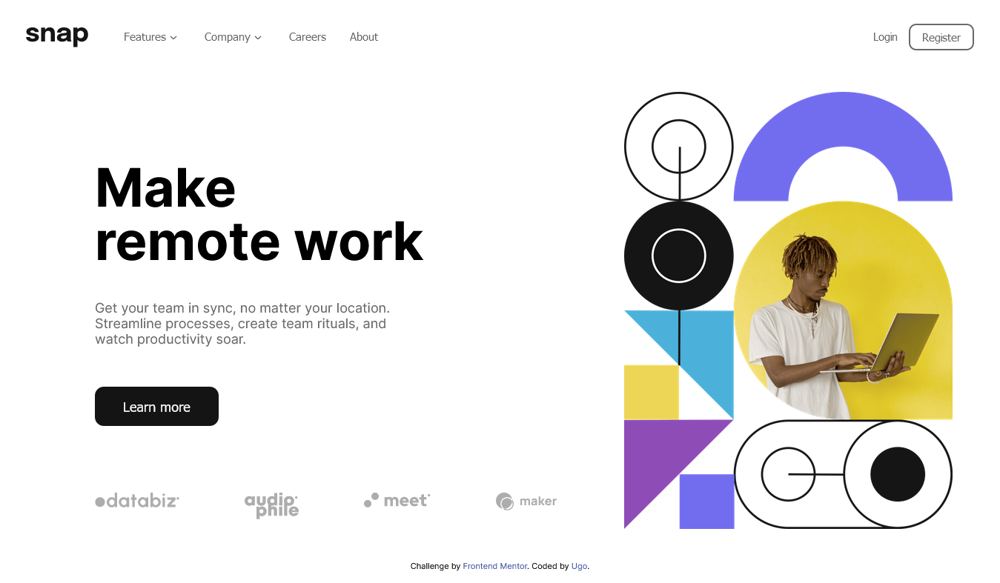

# Frontend Mentor - Intro section with dropdown navigation solution

PLEASE BEAR WITH ME. THIS IS MY FIRST README

This is a solution to the [Intro section with dropdown navigation challenge on Frontend Mentor](https://www.frontendmentor.io/challenges/intro-section-with-dropdown-navigation-ryaPetHE5). Frontend Mentor challenges help you improve your coding skills by building realistic projects.

## Table of contents

- [Overview]
  - [The challenge]
  - [Screenshot]
  - [Links]
- [My process]
  - [Built with]
  - [What I learned]
  - [Continued development]
  - [Useful resources]
- [Author]
- [Acknowledgments]

## Overview

The challenge is basically to help you learn how to implement dropdown functionality in a website

### The challenge

Users should be able to:

- View the relevant dropdown menus on desktop and mobile when interacting with the navigation links
- View the optimal layout for the content depending on their device's screen size
- See hover states for all interactive elements on the page

### Screenshot

;
I can't take a screenshot of the mobile version on firefox

### Links

- Solution URL: [Add solution URL here](https://your-solution-url.com)
- Live Site URL: [Add live site URL here](https://your-live-site-url.com)

## My process

It was quite tedious especially when it came to designing the mobile version

### Built with

- Semantic HTML5 markup
- Flexbox
- CSS Grid
- desktop-first workflow
- Vanilla Javascript
- Some css custom properties

### What I learned

I am only writing this after finishing the challenge so i won't have any code examples.It did take quite a while to finish the projects maybe like 2 weeks of something like that due exams that were ongoing

1 First of all and probably the biggest thing I've learned is that I'm not the only one struggling, whenever I run into a problem I usually tend to think that I'm being cheated and that other people can't run into the same problems as those I'm facing. This is definitely wrong and it's a mentality that i need to clear from my head

2 one problem I ran into while writing the code for this project is the issue of stacking context. So apparently you can't give a child a lower z-index than its parent because the child is inside the parent so you cant bring the parent on top of the child

### Continued development

I plan on developing my js DOM manipulation skills and also get better at making responsive layouts

### Useful resources

- Just go watch Youtube
- You can also read some articles too on stuff you don't understand

## Author

Hi, my name is Ugo.I'm 16.As of writing this README I haven't posted anything on twitter yet cause I'm kind of not really into social media except for youtube cause youtube is the best. I do however plan on being more active online(maybe after my finals) and if you're about the same age as me, feel free to reach out to me so we can see if we can work together and maybe be friends

- Frontend Mentor - [@yourusername](https://www.frontendmentor.io/profile/yourusername)
- Twitter - [@yourusername](https://www.twitter.com/yourusername)
- Gmail - [ugochukwuobianuonye@gmail.com]()

## Acknowledgments

1 In order to implement the dropdown functionality, I had to watch webdevsimplified's youtube video on dropdown menus which was very helpful

2 I had to watch Kevin Powell's youtube video on the picture element in order to implement different images for different screen sizes
